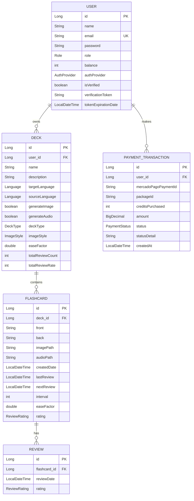

# Spaced Repetition AI

<div align="center">


**Sistema inteligente de aprendizado por repetição espaçada com geração de conteúdo multimodal powered by AI**

[Características](#-características-principais) • [Tecnologias](#-stack-tecnológico) • [Instalação](#-instalação-e-configuração) • [API](#-documentação-da-api) • [Arquitetura](#-arquitetura-do-projeto)

</div>

---

## 📖 Visão Geral

**Spaced Repetition AI** é uma plataforma backend robusta e escalável que revoluciona o aprendizado através da técnica de repetição espaçada combinada com inteligência artificial. O sistema utiliza a API do **Google Gemini** para gerar automaticamente flashcards multimodais (texto, imagem e áudio) a partir de simples prompts, eliminando a necessidade de criação manual de conteúdo educacional.

### 🎯 Problema Resolvido

Criar flashcards de qualidade é um processo manual, demorado e repetitivo. Este projeto automatiza completamente essa tarefa, permitindo que estudantes foquem no que realmente importa: o aprendizado.

### 💡 Solução

- ✅ Geração automática de conteúdo educacional com IA
- ✅ Suporte multimodal: texto, imagens e pronúncia em áudio
- ✅ Algoritmo de repetição espaçada otimizado
- ✅ Sistema de créditos e monetização integrado
- ✅ Armazenamento em cloud com AWS S3 e CloudFront
- ✅ Autenticação social (Google, GitHub) e local

---

## ✨ Características Principais

### 🔐 Autenticação e Autorização
- **Autenticação JWT** com tokens seguros de 256 bits
- **OAuth 2.0** integrado (Google e GitHub)
- Verificação de email com tokens temporários
- Sistema de roles e permissões

### 📚 Gerenciamento de Decks
- CRUD completo de decks de estudo
- Configuração personalizada por deck:
  - Idiomas de origem e destino
  - Estilos de imagem (Anime, Fotorrealismo, Cartoon, Filme)
  - Geração de imagem/áudio habilitada/desabilitada
  - Tipo de deck (Idioma, Geral)
- Estatísticas de performance (taxa de acerto, progresso)

### 🃏 Flashcards Inteligentes
- **Geração manual**: criação tradicional com front/back
- **Geração com IA**: criação automática completa
  - Texto otimizado para memorização
  - Imagens mnemônicas contextualizadas
  - Áudio com pronúncia nativa (TTS)
- Templates de prompt especializados:
  - Idiomas estrangeiros
  - Flashcards múltiplos em lote
  - Conceitos gerais educacionais

### 🧠 Sistema de Repetição Espaçada
- Algoritmo baseado no método SM-2 (SuperMemo)
- Ajuste dinâmico do **ease factor**
- 4 níveis de avaliação: ERRADO, DIFÍCIL, BOM, FÁCIL
- Cálculo inteligente da próxima revisão
- Tracking de performance por deck e card

### 💰 Sistema de Monetização
- Integração completa com **Mercado Pago**
- Sistema de créditos (balance)
- 3 pacotes de créditos pré-configurados:
  - 300 créditos: R$ 40,00
  - 600 créditos: R$ 70,00
  - 1000 créditos: R$ 100,00
- Webhooks para processamento automático de pagamentos
- Consumo de créditos:
  - Geração de imagem: 5 créditos
  - Geração de áudio: 1 crédito

### ☁️ Infraestrutura Cloud
- **AWS S3**: armazenamento escalável de mídia
- **CloudFront**: CDN global com signed cookies
- Upload via presigned URLs
- Conversão automática de áudio para WAV

### 🔄 Processamento Assíncrono
- Geração de conteúdo IA em background
- Retry automático com backoff exponencial
- Thread pool configurável
- Envio de emails assíncrono

---

## 🚀 Stack Tecnológico

### Backend Core
- **Java 17** - Linguagem principal
- **Spring Boot 3.5.3** - Framework enterprise
  - Spring Web (REST APIs)
  - Spring Security (Autenticação/Autorização)
  - Spring Data JPA (ORM)
  - Spring OAuth2 Client
  - Spring Mail (Email SMTP)
  - Spring Retry (Resilência)

### Banco de Dados
- **PostgreSQL** - Banco relacional principal
- **H2** - Banco em memória para testes

### Inteligência Artificial
- **Google Gemini API**
  - Modelo: `gemini-2.5-flash` (texto)
  - Modelo: `imagen-4.0-fast-generate-001` (imagem)
  - Modelo: `gemini-2.5-flash-preview-tts` (áudio)

### Segurança
- **JWT (jjwt 0.12.5)** - Autenticação stateless
- **BCrypt** - Hash de senhas
- **OAuth 2.0** - Login social

### Pagamentos
- **Mercado Pago SDK** - Gateway de pagamento brasileiro

### Cloud & Storage
- **AWS SDK for Java**
  - S3 Client (armazenamento)
  - CloudFront (distribuição)

### Build & DevOps
- **Maven** - Gerenciamento de dependências
- **Docker** - Containerização
- **Docker Compose** - Orquestração local

### Testes
- **JUnit 5** - Framework de testes
- **Mockito 5.18** - Mocking
- **Spring Boot Test** - Testes de integração

### Outras Bibliotecas
- **Lombok** - Redução de boilerplate
- **Jackson** - Serialização JSON
- **Jakarta Validation** - Validação de dados
- **SLF4J + Logback** - Logging

---

## 📋 Pré-requisitos

Antes de começar, certifique-se de ter instalado:

- ☕ **Java JDK 17** ou superior ([Download](https://adoptium.net/))
- 📦 **Maven 3.8+** ([Download](https://maven.apache.org/download.cgi))
- 🐘 **PostgreSQL 15+** ([Download](https://www.postgresql.org/download/))
- 🐳 **Docker** e **Docker Compose** (opcional, para deployment)
- 🔑 **Conta Google Cloud** (para Gemini API)
- 💳 **Conta Mercado Pago** (para gateway de pagamento)
- ☁️ **Conta AWS** (para S3 e CloudFront)

---

## 🛠️ Instalação e Configuração

### 1. Clone o Repositório

```bash
git clone https://github.com/IgorLana/Spaced-Repetition-AI.git
cd Spaced-Repetition-AI
```

### 2. Configure o Banco de Dados PostgreSQL

Crie um banco de dados para a aplicação:

```sql
CREATE DATABASE spaced_repetition_db;
CREATE USER spaced_user WITH PASSWORD 'your_secure_password';
GRANT ALL PRIVILEGES ON DATABASE spaced_repetition_db TO spaced_user;
```

### 3. Configure as Variáveis de Ambiente

Crie ou edite o arquivo `src/main/resources/application.properties`:

```properties
# ===================================================================
# CONFIGURAÇÕES DO BANCO DE DADOS
# ===================================================================
spring.datasource.url=jdbc:postgresql://localhost:5432/spaced_repetition_db
spring.datasource.username=spaced_user
spring.datasource.password=your_secure_password
spring.datasource.driver-class-name=org.postgresql.Driver

# ===================================================================
# CONFIGURAÇÕES DO JPA/HIBERNATE
# ===================================================================
spring.jpa.hibernate.ddl-auto=update
spring.jpa.show-sql=false
spring.jpa.properties.hibernate.dialect=org.hibernate.dialect.PostgreSQLDialect
spring.jpa.properties.hibernate.format_sql=true

# ===================================================================
# CONFIGURAÇÕES DO SERVIDOR
# ===================================================================
server.port=9090

# ===================================================================
# CONFIGURAÇÕES DE SEGURANÇA (JWT)
# ===================================================================
# IMPORTANTE: Gere uma chave segura de 256+ bits
jwt.secret-key=YOUR_SUPER_SECRET_JWT_KEY_WITH_AT_LEAST_256_BITS_CHANGE_THIS

# ===================================================================
# GOOGLE GEMINI API
# ===================================================================
gemini.api.key=YOUR_GEMINI_API_KEY_HERE

# ===================================================================
# MERCADO PAGO
# ===================================================================
api.v1.mercadopago-access-token=YOUR_MERCADOPAGO_ACCESS_TOKEN

# ===================================================================
# AWS S3 E CLOUDFRONT
# ===================================================================
aws.s3.bucket-name=your-s3-bucket-name
aws.s3.region=sa-east-1
aws.access-key=YOUR_AWS_ACCESS_KEY
aws.secret-key=YOUR_AWS_SECRET_KEY
cloudfront.domain-name=your-cloudfront-distribution.cloudfront.net
cloudfront.key-pair-id=YOUR_CLOUDFRONT_KEY_PAIR_ID
cloudfront.private-key-path=/path/to/cloudfront_private_key.pem

# ===================================================================
# OAUTH2 (GOOGLE E GITHUB)
# ===================================================================
spring.security.oauth2.client.registration.google.client-id=YOUR_GOOGLE_CLIENT_ID
spring.security.oauth2.client.registration.google.client-secret=YOUR_GOOGLE_CLIENT_SECRET
app.oauth2.redirect-uri=http://localhost:4200/auth/callback

spring.security.oauth2.client.registration.github.client-id=YOUR_GITHUB_CLIENT_ID
spring.security.oauth2.client.registration.github.client-secret=YOUR_GITHUB_CLIENT_SECRET
spring.security.oauth2.client.registration.github.scope=read:user,user:email

# ===================================================================
# CONFIGURAÇÕES DE EMAIL (SMTP)
# ===================================================================
spring.mail.host=smtp.gmail.com
spring.mail.port=587
spring.mail.username=your-email@gmail.com
spring.mail.password=your-app-specific-password
spring.mail.properties.mail.smtp.auth=true
spring.mail.properties.mail.smtp.starttls.enable=true

# ===================================================================
# OUTRAS CONFIGURAÇÕES
# ===================================================================
spring.servlet.multipart.max-file-size=20MB
spring.servlet.multipart.max-request-size=20MB
spring.jackson.time-zone=UTC
cookie-domain=localhost
logging.level.com.spaced_repetition_ai.service=INFO
```

### 4. Obtenha as Credenciais Necessárias

#### Google Gemini API
1. Acesse [Google AI Studio](https://makersuite.google.com/app/apikey)
2. Crie um projeto e gere uma API Key
3. Copie a key para `gemini.api.key`

#### Mercado Pago
1. Acesse o [Mercado Pago Developers](https://www.mercadopago.com.br/developers)
2. Crie uma aplicação
3. Copie o **Access Token** (teste ou produção)
4. Configure o webhook URL: `https://your-domain.com/api/v1/webhooks/mercadopago`

#### AWS S3 e CloudFront
1. Crie um bucket S3
2. Configure uma distribuição CloudFront
3. Gere um Key Pair para signed URLs
4. Configure as credenciais IAM

#### OAuth2 (Google e GitHub)
- **Google**: [Console Cloud](https://console.cloud.google.com/apis/credentials)
- **GitHub**: [Developer Settings](https://github.com/settings/developers)

### 5. Compile e Execute a Aplicação

#### Usando Maven

```bash
# Compile o projeto
mvn clean install

# Execute a aplicação
mvn spring-boot:run
```

#### Usando Docker

```bash
# Build da imagem
docker build -t spaced-repetition-ai .

# Execute o container
docker-compose up -d
```

### 6. Verifique a Aplicação

A API estará disponível em: **http://localhost:9090**

Teste o health check:
```bash
curl http://localhost:9090/api/auth/login
```

---

## 📡 Documentação da API

Todos os endpoints (exceto `/api/auth/*`) requerem autenticação JWT via header:

```
Authorization: Bearer <seu-token-jwt>
```

### 🔐 Autenticação (`/api/auth`)

#### **POST** `/api/auth/register`
Registra um novo usuário no sistema.

**Request Body:**
```json
{
  "name": "João Silva",
  "email": "joao.silva@example.com",
  "password": "SenhaForte123!"
}
```

**Response:** `200 OK`
```json
{
  "message": "Registro bem-sucedido. Por favor, verifique seu e-mail para ativar a conta.",
  "token": null
}
```

#### **POST** `/api/auth/login`
Autentica um usuário e retorna um token JWT.

**Request Body:**
```json
{
  "email": "joao.silva@example.com",
  "password": "SenhaForte123!"
}
```

**Response:** `200 OK`
```json
{
  "message": "Login realizado com sucesso",
  "token": "eyJhbGciOiJIUzI1NiIsInR5cCI6IkpXVCJ9..."
}
```

#### **GET** `/api/auth/verify`
Verifica o email do usuário via token.

**Query Params:**
- `token`: Token de verificação enviado por email

**Response:** `200 OK`

---

### 📚 Decks (`/api/deck`)

#### **GET** `/api/deck`
Lista todos os decks do usuário autenticado.

**Response:** `200 OK`
```json
[
  {
    "id": 1,
    "name": "Vocabulário de Inglês",
    "description": "Palavras essenciais para iniciantes",
    "targetLanguage": "INGLES_EUA",
    "sourceLanguage": "PORTUGUES_BRASIL",
    "easeFactor": 2.5,
    "generateImage": true,
    "generateAudio": true,
    "deckType": "LANGUAGE",
    "imageStyle": "ANIME_STYLE"
  }
]
```

#### **GET** `/api/deck/{deckId}/info`
Retorna informações detalhadas de um deck específico.

**Response:** `200 OK`
```json
{
  "id": 1,
  "name": "Vocabulário de Inglês",
  "description": "Palavras essenciais",
  "targetLanguage": "INGLES_EUA",
  "sourceLanguage": "PORTUGUES_BRASIL",
  "easeFactor": 2.5,
  "generateImage": true,
  "generateAudio": true,
  "deckType": "LANGUAGE",
  "flashcardsToReview": 12,
  "totalFlashcards": 50,
  "averageScore": 0.85
}
```

#### **POST** `/api/deck`
Cria um novo deck.

**Request Body:**
```json
{
  "name": "Espanhol Básico",
  "description": "Primeiras 500 palavras",
  "targetLanguage": "ESPANHOL_EUA",
  "sourceLanguage": "PORTUGUES_BRASIL",
  "generateImage": true,
  "generateAudio": true,
  "deckType": "LANGUAGE",
  "imageStyle": "PHOTOREALISM",
  "easeFactor": 2.0
}
```

**Response:** `201 Created`

#### **PUT** `/api/deck/{id}`
Atualiza um deck existente.

**Request Body:**
```json
{
  "name": "Novo Nome",
  "description": "Nova descrição",
  "targetLanguage": "INGLES_EUA",
  "sourceLanguage": "PORTUGUES_BRASIL",
  "easeFactor": 2.2
}
```

**Response:** `200 OK`

#### **DELETE** `/api/deck/{deckId}`
Remove um deck e todos os seus flashcards.

**Response:** `204 No Content`

---

### 🃏 Flashcards (`/api/flashcard`)

#### **GET** `/api/flashcard`
Lista todos os flashcards de um deck.

**Query Params:**
- `deckId`: ID do deck

**Response:** `200 OK`
```json
[
  {
    "id": 1,
    "front": "Cat",
    "back": "Gato",
    "imagePath": "https://cdn.example.com/images/cat.png",
    "audioPath": "https://cdn.example.com/audio/cat.wav",
    "createdDate": "2025-10-01T10:00:00",
    "lastReview": "2025-10-04T15:30:00",
    "nextReview": "2025-10-07T15:30:00",
    "interval": 3,
    "easeFactor": 2.5,
    "rating": "BOM"
  }
]
```

#### **POST** `/api/flashcard`
Cria um flashcard manualmente.

**Query Params:**
- `deckId`: ID do deck

**Request Body:**
```json
{
  "front": "Hello",
  "back": "Olá",
  "imagePath": null,
  "audioPath": null
}
```

**Response:** `201 Created`

#### **POST** `/api/flashcard/ai`
Gera um flashcard completo usando IA (texto + imagem + áudio).

**Query Params:**
- `deckId`: ID do deck
- `prompt`: Palavra ou conceito (ex: "dog", "photosynthesis")

**Response:** `200 OK`
```json
{
  "id": 15,
  "front": "Dog",
  "back": "Cachorro\n\nExample: The dog is playing in the park.",
  "imagePath": "https://cdn.example.com/images/dog-abc123.png",
  "audioPath": "https://cdn.example.com/audio/dog-abc123.wav",
  "createdDate": "2025-10-05T10:00:00",
  "nextReview": "2025-10-05T10:01:00",
  "interval": 1,
  "easeFactor": 2.5,
  "rating": "BOM"
}
```

**Custos:**
- Geração de imagem: 5 créditos
- Geração de áudio: 1 crédito
- **Total**: 6 créditos por flashcard completo

#### **PUT** `/api/flashcard/{id}`
Atualiza um flashcard existente.

**Request Body:**
```json
{
  "front": "Cat (updated)",
  "back": "Gato (atualizado)",
  "imagePath": "https://...",
  "audioPath": "https://..."
}
```

**Response:** `200 OK`

#### **DELETE** `/api/flashcard/{flashCardId}`
Remove um flashcard.

**Response:** `204 No Content`

---

### 🧠 Revisão (`/api/review`)

#### **GET** `/api/review`
Retorna os flashcards prontos para revisão em um deck.

**Query Params:**
- `id`: ID do deck

**Response:** `200 OK`
```json
[
  {
    "id": 5,
    "front": "Apple",
    "back": "Maçã",
    "nextReview": "2025-10-05T09:00:00"
  },
  {
    "id": 12,
    "front": "Tree",
    "back": "Árvore",
    "nextReview": "2025-10-05T08:30:00"
  }
]
```

Se não houver cards para revisar: `204 No Content`

#### **POST** `/api/review`
Registra uma revisão e atualiza o algoritmo de repetição espaçada.

**Query Params:**
- `id`: ID do flashcard
- `review`: Avaliação (`ERRADO`, `DIFICIL`, `BOM`, `FACIL`)

**Lógica do Algoritmo:**
- **ERRADO**: `interval = 1 dia`, `easeFactor -= 0.20`
- **DIFICIL**: `interval *= (easeFactor - 0.15)`
- **BOM**: `interval *= easeFactor`
- **FACIL**: `interval *= (easeFactor + 0.15)`

**Response:** `200 OK`

---

### 💳 Pagamentos (`/api/v1/payment`)

#### **POST** `/api/v1/payment/preference`
Cria uma preferência de pagamento no Mercado Pago.

**Request Body:**
```json
{
  "packageId": "package_600"
}
```

**Pacotes Disponíveis:**
- `package_300`: 300 créditos por R$ 40,00
- `package_600`: 600 créditos por R$ 70,00
- `package_1000`: 1000 créditos por R$ 100,00

**Response:** `200 OK`
```json
{
  "preferenceId": "123456789-abcd-1234-5678-abc123def456",
  "initPoint": "https://www.mercadopago.com.br/checkout/v1/redirect?pref_id=..."
}
```

#### **POST** `/api/v1/webhooks/mercadopago`
Webhook para processar notificações de pagamento (uso interno).

---

### 👤 Usuário (`/api/user`)

#### **GET** `/api/user/me`
Retorna as informações do usuário autenticado.

**Response:** `200 OK`
```json
{
  "id": 1,
  "name": "João Silva",
  "email": "joao.silva@example.com",
  "balance": 150,
  "role": "USER",
  "isVerified": true,
  "authProvider": "LOCAL"
}
```

---

## 🏗️ Arquitetura do Projeto

O projeto segue uma arquitetura em camadas (Layered Architecture) com separação clara de responsabilidades:

```
src/main/java/com/spaced_repetition_ai/
│
├── config/                          # Configurações do Spring
│   ├── ApplicationConfig.java       # Beans de autenticação
│   ├── AsyncConfig.java             # Configuração de threads assíncronas
│   ├── AWSConfig.java               # Beans AWS S3 e CloudFront
│   ├── JwtAuthFilter.java           # Filtro JWT
│   ├── OAuth2AuthenticationSuccessHandler.java
│   ├── SecurityConfig.java          # Configuração Spring Security
│   └── StaticResourceConfig.java    # Servir arquivos estáticos
│
├── controller/                      # Camada de Apresentação (REST)
│   ├── AudioGenerationController.java
│   ├── AuthController.java
│   ├── DeckController.java
│   ├── FlashCardController.java
│   ├── ImageGenerationController.java
│   ├── ReviewController.java
│   ├── TextGenerationController.java
│   └── UserController.java
│
├── dto/                             # Data Transfer Objects
│   ├── AuthRequestDTO.java
│   ├── AuthResponse.java
│   ├── DeckRequestDTO.java
│   ├── DeckResponseDTO.java
│   ├── FlashcardRequestDTO.java
│   ├── FlashcardResponseDTO.java
│   └── ...
│
├── entity/                          # Entidades JPA (Camada de Persistência)
│   ├── DeckEntity.java              # Tabela: decks
│   ├── FlashCardEntity.java         # Tabela: flashcards
│   ├── ReviewEntity.java            # Tabela: reviews
│   ├── UserEntity.java              # Tabela: users
│   └── StandardFlashCardEntity.java
│
├── exception/                       # Tratamento de Exceções
│   ├── DatabaseException.java
│   ├── ExternalServiceException.java
│   ├── GlobalExceptionHandler.java  # @RestControllerAdvice
│   └── NotFoundException.java
│
├── model/                           # Enums e Modelos de Domínio
│   ├── AuthProvider.java            # LOCAL, GOOGLE, GITHUB
│   ├── DeckType.java                # LANGUAGE, GENERAL
│   ├── ImageStyle.java              # ANIME, PHOTOREALISM, CARTOON, FILME
│   ├── Language.java                # INGLES_EUA, PORTUGUES_BRASIL, etc.
│   ├── ReviewRating.java            # ERRADO, DIFICIL, BOM, FACIL
│   ├── Role.java                    # USER, ADMIN
│   └── TextPromptStyle.java         # Templates de prompts
│
├── payment/                         # Módulo de Pagamentos
│   ├── client/
│   │   └── MercadoPagoClient.java   # Cliente HTTP Mercado Pago
│   ├── controller/
│   │   ├── CreatePaymentPreferenceController.java
│   │   └── WebhookController.java
│   ├── dto/
│   ├── entity/
│   │   ├── Payment.java
│   │   └── PaymentTransaction.java  # Histórico de transações
│   ├── repository/
│   │   └── PaymentTransactionRepository.java
│   └── service/
│       ├── CreatePaymentPreferenceService.java
│       └── ProcessPaymentNotificationService.java
│
├── repository/                      # Interfaces Spring Data JPA
│   ├── DeckRepository.java
│   ├── FlashCardRepository.java
│   ├── ReviewRepository.java
│   └── UserRepository.java
│
├── service/                         # Camada de Negócio
│   ├── AudioGenerationService.java  # Gemini TTS
│   ├── AwsService.java              # S3 + CloudFront
│   ├── CustomOAuth2UserService.java # OAuth2 Google/GitHub
│   ├── CustomOidcUserService.java
│   ├── DeckService.java             # Lógica de Decks
│   ├── EmailService.java            # SMTP Gmail
│   ├── FlashCardService.java        # Lógica de Flashcards
│   ├── ImageGenerationService.java  # Gemini Imagen
│   ├── JwtService.java              # Geração/Validação JWT
│   ├── ReviewService.java           # Algoritmo de Repetição Espaçada
│   ├── TextGenerationService.java   # Gemini Text
│   └── UserService.java
│
├── util/                            # Classes Utilitárias
│   └── PromptTemplates.java
│
└── SpacedRepetitionAiApplication.java  # Classe Main
```

### 📊 Modelo de Dados (Entidades Principais)



---

## 🔬 Testes

O projeto possui cobertura de testes unitários e de integração.

### Executar Todos os Testes

```bash
mvn test
```

### Executar Teste Específico

```bash
mvn test -Dtest=DeckServiceTest
```

### Configuração de Testes

Os testes utilizam:
- **H2 Database** (banco em memória)
- **Mockito** para mock de dependências
- Perfil de teste: `src/test/resources/application-teste.properties`

### Estrutura de Testes

```
src/test/java/com/spaced_repetition_ai/
├── repository/
│   └── DeckRepositoryTest.java
├── service/
│   └── DeckServiceTest.java
└── SpacedRepetitionAiApplicationTests.java
```

---

## 🐳 Deployment com Docker

### Build da Imagem

```bash
docker build -t spaced-repetition-ai:latest .
```

### Executar com Docker Compose

```bash
docker-compose up -d
```

O `docker-compose.yml` configura:
- Aplicação Spring Boot (porta 9090)
- PostgreSQL (opcional, se não usar externo)
- Variáveis de ambiente via arquivo `.env`

### Exemplo de `.env`

```env
SPRING_DATASOURCE_URL=jdbc:postgresql://postgres:5432/spaced_repetition_db
SPRING_DATASOURCE_USERNAME=postgres
SPRING_DATASOURCE_PASSWORD=postgres
JWT_SECRET_KEY=your-jwt-secret-key
GEMINI_API_KEY=your-gemini-api-key
MERCADOPAGO_ACCESS_TOKEN=your-mercadopago-token
AWS_ACCESS_KEY=your-aws-access-key
AWS_SECRET_KEY=your-aws-secret-key
```

---

## 🤝 Como Contribuir

Contribuições são bem-vindas! Siga os passos abaixo:

### 1. Fork o Projeto

```bash
git clone https://github.com/seu-usuario/Spaced-Repetition-AI.git
cd Spaced-Repetition-AI
```

### 2. Crie uma Branch para sua Feature

```bash
git checkout -b feature/minha-nova-feature
```

### 3. Faça suas Alterações e Commit

```bash
git add .
git commit -m "feat: adiciona nova funcionalidade X"
```

**Padrão de Commits (Conventional Commits):**
- `feat`: Nova funcionalidade
- `fix`: Correção de bug
- `docs`: Atualização de documentação
- `refactor`: Refatoração de código
- `test`: Adição/correção de testes
- `chore`: Tarefas de manutenção

### 4. Push para o GitHub

```bash
git push origin feature/minha-nova-feature
```

### 5. Abra um Pull Request

Descreva detalhadamente suas alterações e o problema que elas resolvem.

### Diretrizes de Código

- Siga as convenções de código Java (Google Java Style Guide)
- Escreva testes para novas funcionalidades
- Mantenha a cobertura de testes acima de 80%
- Documente classes e métodos públicos com Javadoc
- Use Lombok para reduzir boilerplate


---

## 👨‍💻 Autor

<div align="center">

### **Igor Lana**

Desenvolvedor Full Stack | Especialista em Java & Spring Boot

[](https://linkedin.com/in/igor-lana/)
[](https://github.com/IgorLana/)
[](mailto:igorlana1@outlook.com)

</div>

---

## 📞 Suporte

Se você encontrar algum problema ou tiver dúvidas:

- 🐛 Abra uma [Issue](https://github.com/IgorLana/Spaced-Repetition-AI/issues)
- 📧 Entre em contato: igorlana1@outlook.com
- 💬 Discussões: [GitHub Discussions](https://github.com/IgorLana/Spaced-Repetition-AI/discussions)


---

<div align="center">

**Se este projeto foi útil para você, considere dar uma ⭐!**

Feito com ❤️ por [Igor Lana](https://github.com/IgorLana)

</div>
